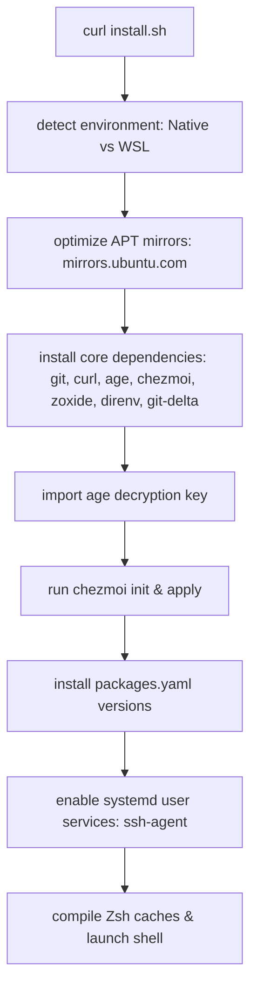

# 🏠 Dotfiles — Idan Botbol

[](https://github.com/Idanbot/.dotfiles/actions/workflows/ci.yml)
[](https://ubuntu.com/download)
[](https://learn.microsoft.com/windows/wsl/)
[](https://chezmoi.io)
[](#-license)

> One-command bootstrap for Ubuntu 24.04 LTS (native & WSL). Managed by [chezmoi](https://chezmoi.io) with [age](https://age-encryption.org) encryption for secrets.

## ⚡ Quick Start

### Fresh Machine (one-liner)

```bash
curl -fsSL https://raw.githubusercontent.com/idanbotbol/dotfiles/main/scripts/install.sh | bash
```

### Or clone and run:

```bash
git clone git@github.com:idanbotbol/dotfiles.git ~/.dotfiles
cd ~/.dotfiles && ./scripts/install.sh
```

### Existing Machine (already have chezmoi)

```bash
chezmoi init --apply idanbotbol/dotfiles --ssh
```

### Bootstrap Flow



### Resume or Run a Focused Section

```bash
./scripts/install.sh --only terminal
./scripts/run-section.sh languages
./scripts/run-section.sh tmux
```

### Post-Install Doctor

```bash
~/.dotfiles/scripts/doctor.sh
```

---

## 📦 What Gets Installed

| Category | Tools |
|----------|-------|
| **Shell** | Zsh, Oh-My-Zsh, Starship prompt, fzf-tab, zsh-autosuggestions, zsh-syntax-highlighting |
| **Terminal** | Kitty (native), Ghostty (secondary), tmux + TPM, tmuxp |
| **Editor** | Neovim (LazyVim), Vim |
| **CLI Tools** | fzf, fd, ripgrep, bat, eza, lazygit, btop, htop, jq, yq, delta, zoxide, direnv, hyperfine, dust, duf, xh, sops |
| **Languages** | Go 1.24, Rust/Cargo (stable), Node.js 24.15.0 (nvm), TypeScript 5.9.3 (npm), Python 3.14.5 (uv), Java 21 |
| **Containers** | Docker, kubectl, Helm, k9s |
| **Cloud** | AWS CLI v2, Google Cloud CLI, Azure CLI, Terraform, Ansible |
| **AI Tools** | Claude CLI, Gemini CLI, OpenCode |
| **Media** | yt-dlp, rmpc, cava (native only) |
| **Fonts** | FiraMono Nerd Font |
| **Theme** | Catppuccin Mocha (everywhere) |

---

## 📁 Repo Structure

```
~/.dotfiles/
├── scripts/install.sh            # Bootstrap entrypoint
├── .chezmoi.yaml.tmpl            # chezmoi init prompts
├── .chezmoiexternal.yaml         # External deps (oh-my-zsh, TPM, etc.)
├── .chezmoiignore                # Platform-specific ignores
├── packages.yaml                 # Version-pinned tool manifest
│
├── dot_zshrc.tmpl                # Zsh config (WSL/native templated)
├── dot_tmux.conf.tmpl            # tmux config (WSL/native templated)
├── dot_gitconfig.tmpl            # Git config (templated email)
├── dot_bashrc / dot_vimrc / ...  # Other configs
│
├── dot_config/                   # ~/.config/ files
│   ├── starship.toml             # Starship prompt
│   ├── nvim/                     # LazyVim config
│   ├── private_kitty/            # Kitty terminal
│   └── ...                       # lazygit, btop, bat, etc.
│
├── dot_local/bin/                # Custom scripts
│   ├── tmux-sessionizer.tmpl     # Project switcher
│   └── fzf-preview.sh            # FZF preview
│
├── encrypted_*                   # age-encrypted secrets
│
├── .chezmoiscripts/              # chezmoi run scripts
│   ├── run_once_before_*.sh.tmpl # Pre-apply install scripts
│   ├── run_once_*.sh.tmpl        # Install scripts
│   └── run_onchange_*.sh.tmpl    # Re-run on manifest change
│
├── scripts/lib.sh                # Shared bash utilities
├── tests/                        # CI test scripts
└── .github/workflows/            # GitHub Actions CI
```

---


## 🧰 Tool Inventory

The tool manifests are split by responsibility:

- [packages.yaml](packages.yaml): requested versions.
- [packages.meta.yaml](packages.meta.yaml): install source metadata such as apt, cargo, npm, GitHub release, or install script.
- [packages.lock](packages.lock): generated audit view with manifest hashes and resolved metadata.
- [docs/tool-inventory.md](docs/tool-inventory.md): generated human-readable inventory.
- [docs/keybindings.md](docs/keybindings.md): generated tmux/zsh keybinding reference.

Regenerate derived files after editing manifests or keybindings:

```bash
./scripts/generate-package-lock.sh
./scripts/generate-tool-inventory.sh
./scripts/generate-keybinding-docs.sh
```

---

## 🔧 chezmoi Workflow Cheat Sheet

| Action | Command |
|--------|--------|
| **Apply configs** | `chezmoi apply` |
| **Pull & apply latest** | `chezmoi update` |
| **Add a config file** | `chezmoi add ~/.config/tool/config` |
| **Add a secret (encrypted)** | `chezmoi add --encrypt ~/.ssh/id_ed25519` |
| **Edit a managed file** | `chezmoi edit ~/.zshrc` |
| **Preview changes** | `chezmoi diff` |
| **View managed files** | `chezmoi managed` |
| **Re-init (re-run prompts)** | `chezmoi init` |
| **Run health check** | `~/.dotfiles/scripts/doctor.sh` |
| **Push changes** | `cd ~/.dotfiles && git add -A && git commit -m "..." && git push` |

---

## ⌨️ Key Bindings

### tmux

| Binding | Action |
|---------|--------|
| `Ctrl-s` | Prefix |
| `Prefix r` | Reload tmux config |
| `Prefix \|` / `Prefix -` | Split pane horizontally / vertically in current directory |
| `Alt-g` | Open lazygit popup |
| `Alt-d` | Docker containers/images popup |
| `Alt-k` | Kubernetes contexts/namespaces popup |
| `Alt-p` | Project picker popup (`tmux-sessionizer`) |
| `Alt-i` | cht.sh query popup |
| `Alt-h` | btop popup |
| `Alt-o` | Open current directory in Windows Explorer (WSL only) |
| `Alt-e` | WSL interop diagnostics popup (WSL only) |
| `Alt-u` | Native utility diagnostics popup (native only) |

### Shell

| Binding/Alias | Action |
|---------------|--------|
| `Ctrl-f` | Run `tmux-sessionizer` |
| `Alt-h` / `Alt-t` / `Alt-n` / `Alt-s` | Open configured sessionizer directory groups |
| `reload` | Reload current shell config |
| `fd` | Compatibility shim to Ubuntu `fdfind` |

---

## 🔐 Secret Management

Secrets are encrypted with [age](https://age-encryption.org) and stored in the repo as `encrypted_*` files.

### Encrypted Files

| File | Target |
|------|--------|
| `encrypted_dot_ssh/` | `~/.ssh/` (keys + config) |
| `encrypted_dot_gnupg/` | `~/.gnupg/` (GPG keys) |
| `encrypted_dot_git-credentials` | `~/.git-credentials` |
| `encrypted_dot_cloudflared/` | `~/.cloudflared/` |
| `encrypted_private_dot_aws/credentials` | `~/.aws/credentials` |

### Key Management

- **Identity key location**: `~/.config/chezmoi/key.txt`
- **⚠️ BACK THIS UP**: Bitwarden, encrypted USB, or another secure location
- **Generate new key**: `age-keygen -o ~/.config/chezmoi/key.txt`
- **Encrypt a new file**: `chezmoi add --encrypt <file>`

---

## 🖥️ WSL vs Native

The bootstrap auto-detects WSL by checking `/proc/version` for "microsoft".

| Feature | Native | WSL |
|---------|--------|-----|
| Kitty terminal | ✅ | ❌ |
| GNOME desktop | ✅ | ❌ |
| Docker Engine | ✅ (full) | CLI only (Docker Desktop) |
| tmux terminal | `xterm-kitty` | `tmux-256color` |
| Battery in tmux | ✅ | ❌ |
| Media tools (rmpc, cava) | ✅ | ❌ |
| Image preview in fzf | ✅ (kitty icat) | ❌ |
| All other tools | ✅ | ✅ |

### 🔧 WSL Troubleshooting & Prerequisites

Before running the bootstrap on a fresh WSL installation, ensure:

1. **Systemd is Enabled:**
   Edit `/etc/wsl.conf` (requires root privileges inside WSL) and add:
   ```ini
   [boot]
   systemd=true
   ```
   After editing, restart WSL from a Windows Host PowerShell terminal:
   ```powershell
   wsl.exe --shutdown
   ```

2. **Windows Git Credential Manager Setup:**
   Ensure Git for Windows is installed on your Windows Host. Chezmoi will automatically bridge credentials from the host to your WSL terminal using the GCM helper routing at `/mnt/c/Program Files/Git/mingw64/bin/git-credential-manager.exe`.

---

## ➕ Adding a New Tool

1. **Update `packages.yaml`** with the version.
2. **Update `packages.meta.yaml`** with source metadata.
3. **Create/update install script** in `.chezmoiscripts/run_once_*.sh.tmpl`.
4. **Regenerate derived files** with `./scripts/generate-package-lock.sh`, `./scripts/generate-tool-inventory.sh`, and `./scripts/generate-keybinding-docs.sh`.
5. **Add config** with `chezmoi add ~/.config/newtool/config`.
6. **Test** with `tests/test-package-metadata.sh`, `tests/test-templates.sh`, and `chezmoi apply --verbose`.
7. **Commit**: `cd ~/.dotfiles && git add -A && git commit -m "Add newtool" && git push`.

Rollback helper for locally managed tools:

```bash
./scripts/uninstall-tool.sh lazygit
./scripts/uninstall-tool.sh dust
```

---

## 🎨 Theme: Catppuccin Mocha

All tools are themed with [Catppuccin Mocha](https://github.com/catppuccin/catppuccin):

- ✅ Starship prompt
- ✅ FZF colors
- ✅ tmux status bar
- ✅ Kitty terminal
- ✅ btop
- ✅ lazygit
- ✅ bat (via BAT_THEME)
- ✅ Neovim (set in LazyVim config)

---

## 📝 Manual Steps

Some things cannot be automated:

1. **Age identity key**: Import `~/.config/chezmoi/key.txt` from backup
2. **Firefox extensions**: Use Firefox Sync (sign in with your Firefox account)
3. **VS Code**: Sign in to Settings Sync (GitHub account)
4. **GNOME extensions** (native only): Install via Extension Manager:
   - Bluetooth Battery Meter
   - System Monitor
   - Grand Theft Focus
   - Caffeine
   - Burn My Windows
   - Coverflow Alt-Tab
   - GNOME UI Tune
   - Impatience
   - Primary Input on Lock Screen
   - Places Menu

---

## 🧪 CI/CD

GitHub Actions runs [CI — Dotfiles Bootstrap](https://github.com/Idanbot/.dotfiles/actions/workflows/ci.yml) on every push/PR to `main`:

- **Lint**: shellcheck, shfmt, hadolint, yamllint, template validation, package metadata validation, generated doc freshness.
- **Chezmoi fixture**: applies templates into a temporary home without running install scripts.
- **Interactive startup**: smoke-tests rendered zsh and tmux startup.
- **Network install smoke**: verifies cargo tools and GitHub-release tools can still be installed.
- **Test Matrix**: Bootstrap test in Docker for:
  - `ubuntu-24.04-native`
  - `ubuntu-24.04-wsl` (simulated)
  - (Extensible for Arch, Fedora, etc.)
- **Idempotency**: Verifies bootstrap can run twice without errors

### Status Tracking

| Check | Coverage | Current Signal |
|-------|----------|----------------|
| **Lint** | shellcheck, shfmt, yamllint, template rendering, repo layout, package metadata, generated docs | Tracks syntax, formatting, YAML, expected layout, manifest coverage, and stale generated files |
| **Dockerfile Lint** | hadolint against `.github/workflows/Dockerfile.ubuntu-24.04` | Tracks container build hygiene |
| **Chezmoi Apply Fixture** | Applies rendered dotfiles into a temporary home with scripts and externals excluded | Tracks template destination behavior without installing packages |
| **Interactive Startup** | zsh interactive startup and tmux config source smoke tests | Tracks shell/tmux parse regressions |
| **Cargo Tool Smoke** | Installs and runs `dust` and `xh` from cargo | Tracks Rust/Cargo tool install drift |
| **GitHub Release Tool Smoke** | Downloads and runs `lazygit`, `lazydocker`, `sops`, and `tealdeer` | Tracks upstream release asset drift |
| **Bootstrap Test** | Ubuntu 24.04 native + simulated WSL containers | Tracks core package availability, sourced libraries, directory creation, and config source files |
| **Idempotency Test** | Re-runs package install logic in the same container | Tracks repeatability and skip behavior after first install |

### Latest Successful Run Review

The supplied run is healthy:

- **Bootstrap**: 20 passed, 0 failed, 0 skipped.
- **Environment coverage**: exercised CI with `WSL=true`, so WSL detection and WSL-safe paths are covered.
- **Core dependencies**: `git`, `curl`, `wget`, `jq`, `make`, and `unzip` were present after setup.
- **Filesystem layout**: expected user directories under `~/Code`, `~/Scripts`, `~/.local/bin`, and `~/.config` were created.
- **Config source coverage**: key chezmoi templates and manifests are present, including `.zshrc`, `.tmux.conf`, `.gitconfig`, `.vimrc`, `starship.toml`, `packages.yaml`, and `.chezmoi.yaml.tmpl`.
- **Idempotency**: the first run installed missing `wget` and `jq`; the second run skipped already-installed packages, confirming repeatable package handling.

One thing to watch: the idempotency output says "All packages correctly skipped on second run (6 skipped)" while the displayed second run shows four package skip lines. That may be expected if the script counts setup or helper operations too, but the log would be clearer if the skipped count matched visible package checks or printed the hidden skipped items.

### Remaining CI Improvement Ideas

1. **Scheduled drift check**: run weekly against `ubuntu:24.04` to catch upstream apt, curl, GitHub release, and install URL changes before the next code change.
2. **Prebuild the Docker test image**: publish the Ubuntu CI image through GitHub Container Registry or use build cache to reduce repeated Docker build time.
3. **Upload logs as artifacts on failure**: preserve bootstrap, idempotency, cargo, and GitHub-release logs for inspection.
4. **Add checksum enforcement**: replace `checksum: null` in `packages.lock` for direct binary downloads and fail CI when checksums are absent.
5. **Add a destructive rollback fixture**: install managed binaries into a temp prefix, then verify `scripts/uninstall-tool.sh` removes them cleanly.

---

## 📄 License

Personal dotfiles. Use at your own risk.
